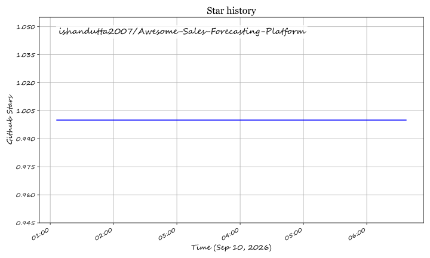

# Awesome-Sales-Forecasting-Platform

## Top Sales Forecasting Platforms Ecosystem

**Curated List of SaaS Products & Open-Source GitHub Projects**

*Focused on Pipeline Inspection, AI Commit Prediction, Revenue Intelligence, Deal Risk & Forecast Accuracy*

**Last updated: September 2026**

This repository tracks notable **SaaS platforms** and **open-source projects** for **Sales Forecasting** and revenue intelligence. These systems improve forecast accuracy through AI, deal inspection, activity capture, and pipeline analytics so revenue leaders can trust the numbers.

**Examples** include Clari, BoostUp, Aviso, People.ai, Anaplan, InsightSquared, Xactly Forecasting, Revenue Grid, Pipeline CRM, SalesChoice, Gong Forecast, Mediafly Revenue360, and Varicent Forecasting (the category leaders).

**Open-source emphasis**: Full AI-driven sales forecasting and revenue-intelligence platforms are almost entirely commercial. Open options focus on **time-series forecasting pipelines, CRM analytics, and custom model frameworks**. This section lists the strongest available projects and is realistic about the gap.

Contributions welcome! Open a PR to add/update entries. Keep descriptions factual and link to official sites.

## Table of Contents

- [SaaS/Hosted Platforms](#saas-products)

- [Open-Source GitHub Projects](#open-source-github-projects)

- [How to Contribute](#how-to-contribute)

- [Disclaimer](#disclaimer)

## SaaS/Hosted Platforms

- **[Clari](https://www.clari.com/)**  

  Leading revenue platform focused on AI-driven forecasting, pipeline inspection, deal risk, and executive-ready forecast defensibility.

- **[BoostUp](https://www.boostup.ai/)**  

  Modern revenue intelligence and forecasting platform emphasizing configurable methodologies, deal inspection, and RevOps workflows.

- **[Aviso / Aviso AI](https://www.aviso.com/)**  

  Long-running AI forecasting specialist with predictive modeling, deal guidance, and revenue intelligence capabilities.

- **[People.ai](https://www.people.ai/)**  

  Activity-capture and revenue-intelligence platform that improves forecast inputs by automatically capturing seller activity and relationship data.

- **[Anaplan](https://www.anaplan.com/)**  

  Connected planning platform frequently used for sales forecasting and broader revenue planning linked to finance.

- **[InsightSquared / Mediafly Intelligence360](https://www.mediafly.com/)**  

  Sales analytics and forecasting capabilities now part of the broader Mediafly revenue-enablement suite.

- **[Xactly Forecasting](https://www.xactlycorp.com/)**  

  Forecasting and sales-performance capabilities within the Xactly SPM ecosystem.

- **[Revenue Grid](https://www.revenuegrid.com/)**  

  Guided selling, activity intelligence, and forecasting platform with strong CRM integration.

- **[Gong Forecast](https://www.gong.io/)**  

  Forecasting capabilities within Gong’s revenue-intelligence platform, leveraging conversation and pipeline signals.

- **[Varicent Forecasting](https://www.varicent.com/)**  

  Forecasting and sales-performance features within the Varicent SPM suite.

- **[SalesChoice, Pipeline CRM and related tools](https://github.com/)**  

  Additional commercial forecasting and pipeline-management solutions used by mid-market and specialized teams.

## Open-Source GitHub Projects

- **[Prophet-based sales forecasting pipelines](https://github.com/)**  

  Numerous open projects using Facebook Prophet (and successors) for time-series sales and revenue forecasting with confidence intervals and seasonality.

- **[AI-powered Sales Forecasting (Prophet + dashboards)](https://github.com/derrickrajkumar10/AI-powered-Sales-Forecasting)**  

  Example end-to-end pipeline combining Prophet forecasting with interactive business dashboards.

- **[Fine-grained / multi-series demand & sales forecasting](https://github.com/databricks-industry-solutions/fine-grained-demand-forecasting)**  

  Open implementations of scalable, hierarchical forecasting suitable for product, region, or segment-level sales prediction.

- **[Retail / sales forecasting MLOps pipelines](https://github.com/)**  

  Full open stacks (Airflow, MLflow, Streamlit, etc.) that train, track, and serve sales forecasts.

- **[Explainable sales forecasting (LightGBM + SHAP, etc.)](https://github.com/)**  

  Projects that combine gradient-boosting or other ML models with explainability for transparent forecast drivers.

- **[CRM analytics and pipeline open dashboards](https://github.com/)**  

  Open BI and SQL-based tools that roll up opportunity data into forecast categories (commit, best case, pipeline).

- **[Custom forecast methodology engines](https://github.com/)**  

  Scripts that implement weighted-pipeline, stage-probability, or historical-conversion forecasting logic on top of CRM exports.

- **[Activity and engagement open capture experiments](https://github.com/)**  

  Community tools that attempt to enrich CRM data with email, calendar, or meeting signals for better forecast inputs.

- **[Scenario and what-if forecasting notebooks](https://github.com/)**  

  Open notebooks for stress-testing forecasts under different win-rate, cycle-time, or seasonality assumptions.

- **[Data-quality and pipeline-hygiene open tooling](https://github.com/)**  

  Scripts that detect stale deals, missing close dates, and other data issues that destroy forecast accuracy.

### Additional Strong Open-Source Options

- Building a transparent forecast from clean CRM data using open time-series or conversion-based models.

- Layering open forecasting pipelines on top of existing CRM and data warehouses.

- Using explainable ML models so sales leaders can understand *why* the forecast moved.

- Accepting that AI deal inspection, automatic activity capture, conversation intelligence signals, and executive-ready forecast workflows still require commercial platforms.

- Focusing open efforts on data quality and baseline statistical forecasts before investing in full revenue-intelligence suites.

**Frameworks for building custom systems**: Clean opportunity and historical close data → apply open forecasting models (Prophet, LightGBM, conversion rates) → surface results in open dashboards → review and adjust in regular forecast calls. This provides a solid, auditable baseline. Commercial platforms (Clari, BoostUp, Aviso, People.ai, Gong Forecast, Revenue Grid, etc.) remain the practical choice when you need AI-driven deal risk, real-time inspection, and trusted executive forecasts at scale.

## How to Contribute

1. Fork the repo.

2. Add/edit entries in `README.md` (follow existing format).

3. Include: name, link, 1–2 sentence description, and whether it's SaaS or open-source.

4. Submit PR with a short explanation.

Star the repo if you find it useful!

## Disclaimer

- This is a **community-curated** list — not exhaustive and not an endorsement.

- Forecasts drive hiring, spending, and investor communication. Inaccurate or opaque models can create serious business risk. Open-source forecasting requires careful validation, ongoing monitoring, and clear ownership of the numbers. Always treat AI predictions as decision support, not automatic truth. This list is not financial or revenue-operations advice.

---

**Made for CROs, RevOps, and sales leaders who want forecasts they can actually defend.**

Let's keep the numbers honest, the process transparent, and the tools as open as practical.

## ⭐ Star History

<a href="https://star-history.com/#ishandutta2007/Awesome-Sales-Forecasting-Platform&Timeline" align="center">
  <picture>
    <source media="(prefers-color-scheme: dark)" srcset="assets/ishandutta2007_Awesome-Sales-Forecasting-Platform_growth.svg">
    
  </picture>
</a>
