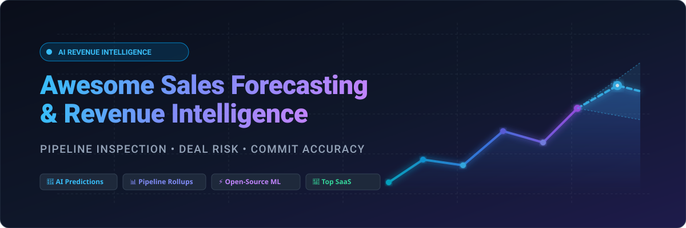

<p align="center">
  
</p>

# 🚀 Awesome Sales Forecasting Platform

<div align="center">

<a href="https://github.com/ishandutta2007/Awesome-Awesome-Awesome"></a>
<a href="https://discord.gg/jc4xtF58Ve"></a>
<a href="https://github.com/ishandutta2007/Awesome-Sales-Forecasting-Platform/stargazers"></a>
<a href="https://github.com/ishandutta2007/Awesome-Sales-Forecasting-Platform/network/members"></a>
<a href="https://github.com/ishandutta2007/Awesome-Sales-Forecasting-Platform/blob/main/LICENSE"></a>
<a href="https://github.com/ishandutta2007/Awesome-Sales-Forecasting-Platform/pulls"></a>
<a href="https://github.com/ishandutta2007"></a>

</div>

<br/>

## 🎯 Top Sales Forecasting & Revenue Intelligence Ecosystem

> **Curated Directory of Commercial SaaS Platforms & Open-Source AI/ML Projects**  
> *Targeted for RevOps Leaders, CROs, Sales Operations, Data Scientists, and Machine Learning Engineers.*  
> **Key Focus Areas:** Pipeline Inspection • AI Commit Prediction • Revenue Intelligence • Deal Risk Scoring • Multi-Horizon Time-Series Forecasting • CRM Analytics

📅 **Last updated:** September 2026

---

## 📖 Introduction & SEO Overview

**Sales Forecasting and Revenue Intelligence platforms** empower modern B2B revenue teams, Chief Revenue Officers (CROs), and RevOps leaders to predict quarterly bookings, mitigate deal slippage, inspect pipeline health, and automate CRM data capture with machine learning.

* 🏢 **Commercial SaaS Suites:** Provide turnkey integrations with Salesforce/HubSpot, conversation intelligence, guided selling, historical stage conversion analytics, and executive rollups.
* 💻 **Open-Source ML Frameworks:** Offer state-of-the-art statistical and deep learning time-series architectures (AutoARIMA, Prophet, N-BEATS, PatchTST, Temporal Fusion Transformers) for building custom demand forecasting models on data lakes (Databricks, Snowflake, BigQuery).

---

## 📑 Table of Contents

- [🏢 SaaS & Hosted Platforms](#-saas--hosted-platforms)
- [💻 Open-Source GitHub Projects](#-open-source-github-projects)
- [🛠️ Custom Architecture & Frameworks](#️-custom-architecture--frameworks)
- [🤝 How to Contribute](#-how-to-contribute)
- [⚖️ Disclaimer](#️-disclaimer)
- [📈 Star History](#-star-history)

---

## 🏢 SaaS & Hosted Platforms

> 📊 **Market Size & Structure Analysis**: The global Sales Forecasting and Revenue Intelligence software market is estimated at **$3.6B–$3.8B (2024–2025)** and projected to surpass **$10.7B by 2033–2034** at a CAGR of **~11.5%**. The sector is **moderately concentrated and rapidly consolidating** into unified revenue action orchestration stacks (dominated by multi-billion-dollar enterprise suites like Anaplan, Gong, and Clari, alongside specialized mid-market AI challengers).

*The table below is ranked in descending order of company size (valuation & ARR scale).*

| Platform | Company Scale (Valuation / Revenue) | Description | Pricing (Starting Tiers) | Free Tier / Trial Limits |
| :--- | :--- | :--- | :--- | :--- |
| **[Anaplan](https://www.anaplan.com/)** | **$10.7B** Valuation (Acquired by Thoma Bravo; ~$600M–$1B ARR) | Enterprise connected planning platform linking sales territory and quota planning, pipeline forecasting, and financial revenue models. | Starts at ~$30,000–$50,000/year base tier (scales by user roles from ~$50–$115/user/mo plus workspace capacity) | No standard free tier; 90-day free trial workspace available via Anaplan Talent Builder / Academy training program (or sales-guided demo) |
| **[Gong Forecast](https://www.gong.io/)** | **$7.25B** Valuation (Series E; $500M+ ARR) | Leading revenue intelligence platform providing AI forecasting grounded in customer conversations, deal progression signals, and pipeline tracking. | Starts at ~$100–$135/user/mo ($1,200–$1,600/user/yr) + mandatory base platform fee ($5,000–$30,000+/yr depending on company size) | No free tier or self-serve trial; private interactive demo and custom enterprise pilot available upon request |
| **[Clari](https://www.clari.com/)** | **$2.6B** Valuation (Series F; ~$450M ARR) | Category-defining revenue platform focused on AI-driven forecasting, pipeline inspection, deal risk scoring, and executive-ready forecast defensibility. | Starts at ~$100–$120/user/mo (billed annually; base platform contracts typically ~$15,000–$25,000/yr; add-on modules $60–$160/user/mo) | No free tier or self-serve trial; sales-assisted live demo & custom POC available upon request |
| **[People.ai](https://www.people.ai/)** | **$1.1B** Valuation (Series D unicorn; ~$65M–$80M ARR) | Enterprise revenue intelligence platform that automates activity and contact capture into CRMs to feed AI-driven pipeline and forecast models. | Starts at ~$50–$100/user/mo (annual billing; median enterprise contract values ~$50,000–$100,000+/yr) | No free tier or self-serve trial; guided product tour and enterprise sales demo upon request |
| **[Varicent Forecasting](https://www.varicent.com/)** | **$1.0B+** Valuation (Acquired by Warburg Pincus/Great Hill; ~$150M–$250M ARR) | Enterprise sales planning and revenue forecasting solution combining quota capacity models, deal commit tracking, and sales performance analytics. | Starts at ~$56–$90/user/mo (annual contracts; enterprise deployments typically start around $25,000–$50,000/yr) | No free tier or self-serve trial; structured interactive demo and custom evaluation upon request |
| **[Xactly Forecasting](https://www.xactlycorp.com/)** | **$564M** Valuation (Acquired by Vista Equity; ~$100M+ ARR) | Sales performance management and pipeline forecasting module that predicts deal slippage and combines incentive compensation with revenue projections. | Starts at ~$40/user/mo for small teams (SimplyComp) / ~$85–$125/user/mo for enterprise forecasting suites (annual billing) | No free tier or self-serve trial; personalized live demo and assessment available upon request |
| **[InsightSquared / Mediafly Intelligence360](https://www.mediafly.com/)** | **~$120M–$150M** Valuation (Mediafly Suite; ~$40M–$50M ARR) | Revenue enablement and sales analytics suite offering machine-learning forecasting, interactive pipeline drill-downs, and activity tracking. | Starts at ~$51–$100/user/mo (or base package starting at ~$16,000–$38,000/yr for revenue intelligence tiers) | No free tier or self-serve trial; guided interactive demo and customized product tour upon request |
| **[BoostUp](https://www.boostup.ai/)** | **~$80M–$100M** Valuation (Series B; ~$10M–$15M ARR) | Configurable revenue intelligence and sales forecasting platform featuring deal risk scoring, pipeline progression, and RevOps workflow automation. | Starts at ~$51–$100/user/mo (annual contracts; typical mid-market deployments range from ~$20,000–$50,000/yr) | No free tier or self-serve trial; sales-led demo and custom 48-hour Proof of Concept (PoC) available upon request |
| **[Aviso AI](https://www.aviso.com/)** | **~$75M–$100M** Valuation (Series C; ~$15M–$25M ARR) | Predictive AI forecasting and deal guidance platform delivering ML win-score predictions, CRM data enrichment, and conversation intelligence. | Starts at ~$50–$80/user/mo (annual commitments; typical enterprise ACVs around ~$50,000–$75,000/yr) | No free tier or self-serve trial; custom live demo and guided pilot evaluation upon request |
| **[Revenue Grid](https://www.revenuegrid.com/)** | **~$50M–$80M** Valuation (Growth Stage; ~$20M–$30M ARR) | Revenue operations and sales forecasting engine featuring automated activity capture, pipeline signals, and guided selling sequences inside CRM. | Starts at $49/user/mo (Activity Capture 360) up to $149/user/mo (Ultimate tier with full Forecasting, billed annually) | 14-day free trial available (full feature access via web signup or Salesforce AppExchange, no credit card required) |
| **[Pipeline CRM](https://www.pipelinecrm.com/)** | **~$30M–$50M** Valuation (Private/Bootstrapped; ~$15M–$20M ARR) | Mid-market CRM and sales pipeline management platform featuring visual deal tracking, revenue forecasting dashboards, and team activity reporting. | Starts at $25/user/mo (Start), $33/user/mo (Develop), $49/user/mo (Grow plan with full forecasting, billed annually) | 14-day free trial on the Grow plan (full access to forecasting and reporting features, no credit card required) |
| **[SalesChoice](https://www.saleschoice.com/)** | **~$5M–$10M** Valuation (Seed/Series A; ~$2M–$5M ARR) | AI-driven predictive sales analytics and forecasting add-on for Salesforce providing win/loss probability scores and deal risk alerts. | Starts at $60 CAD (~$45 USD)/user/mo (available on Salesforce AppExchange; requires Salesforce subscription) | No free tier; offers guided demo / trial pilot arranged with sales team on request |

---

## 💻 Open-Source GitHub Projects

*The open-source projects below provide time-series forecasting algorithms, Bayesian models, neural networks, and automated pipeline scripts for sales prediction. Ranked in descending order of GitHub stars.*

- **[facebook/prophet](https://github.com/facebook/prophet)** [](https://github.com/facebook/prophet/stargazers)  
  *Decomposable time-series model (trend, seasonality, holidays) designed for business forecasting, capacity planning, and revenue projections at scale.*

- **[thuml/Time-Series-Library](https://github.com/thuml/Time-Series-Library)** [](https://github.com/thuml/Time-Series-Library/stargazers)  
  *Comprehensive deep learning library covering advanced Transformer architectures (PatchTST, Crossformer, TimesNet, DLinear) for long-sequence revenue and sales forecasting.*

- **[sktime/sktime](https://github.com/sktime/sktime)** [](https://github.com/sktime/sktime/stargazers)  
  *Unified framework for machine learning with time series, providing scikit-learn compatible algorithms for multivariate sales forecasting and reduction strategies.*

- **[unit8co/darts](https://github.com/unit8co/darts)** [](https://github.com/unit8co/darts/stargazers)  
  *Python library for user-friendly forecasting and anomaly detection on time series, featuring unified APIs from ARIMA/ExponentialSmoothing to TiDE, TFT, and N-BEATS.*

- **[facebookresearch/Kats](https://github.com/facebookresearch/Kats)** [](https://github.com/facebookresearch/Kats/stargazers)  
  *End-to-end framework for time series analysis by Meta Infrastructure, offering forecasting models, changepoint detection, outlier removal, and time-series feature engineering.*

- **[timeseriesAI/tsai](https://github.com/timeseriesAI/tsai)** [](https://github.com/timeseriesAI/tsai/stargazers)  
  *State-of-the-art Deep Learning library for time series and sequence forecasting built on PyTorch and fastai.*

- **[awslabs/gluonts](https://github.com/awslabs/gluonts)** [](https://github.com/awslabs/gluonts/stargazers)  
  *Probabilistic time series modeling toolbox in Python by AWS Labs, with deep learning architectures (DeepAR, Temporal Fusion Transformers) for demand and sales prediction.*

- **[Nixtla/statsforecast](https://github.com/Nixtla/statsforecast)** [](https://github.com/Nixtla/statsforecast/stargazers)  
  *Ultra-fast statistical and econometric forecasting models (AutoARIMA, AutoETS, Theta, CES) optimized with C++/Numba to forecast millions of SKU/sales series in seconds.*

- **[salesforce/Merlion](https://github.com/salesforce/Merlion)** [](https://github.com/salesforce/Merlion/stargazers)  
  *Salesforce’s Python machine learning framework for time series intelligence, offering unified data loading, model ensembling, anomaly detection, and business metric forecasting.*

- **[ourownstory/neural_prophet](https://github.com/ourownstory/neural_prophet)** [](https://github.com/ourownstory/neural_prophet/stargazers)  
  *Hybrid bridge between statistical forecasting and deep learning, combining interpretable Prophet components with PyTorch neural networks and autoregression.*

- **[Nixtla/neuralforecast](https://github.com/Nixtla/neuralforecast)** [](https://github.com/Nixtla/neuralforecast/stargazers)  
  *Scalable and user-friendly deep learning forecasting library featuring N-BEATS, N-HiTS, PatchTST, and NHITS models for multivariate sales and pipeline trajectories.*

- **[uber/orbit](https://github.com/uber/orbit)** [](https://github.com/uber/orbit/stargazers)  
  *Uber's Bayesian time-series forecasting package using Stan and Pyro for probabilistic trend modeling, marketing mix modeling, and revenue forecasting.*

- **[alkaline-ml/pmdarima](https://github.com/alkaline-ml/pmdarima)** [](https://github.com/alkaline-ml/pmdarima/stargazers)  
  *Statistical Python library bringing R's `auto.arima` functionality to Python for automated ARIMA parameter tuning in sales time series.*

- **[databricks-industry-solutions/fine-grained-demand-forecasting](https://github.com/databricks-industry-solutions/fine-grained-demand-forecasting)** [](https://github.com/databricks-industry-solutions/fine-grained-demand-forecasting/stargazers)  
  *Hierarchical, store-item and product-level sales forecasting accelerator using Spark, Delta Lake, and Prophet on Databricks.*

- **[derrickrajkumar10/AI-powered-Sales-Forecasting](https://github.com/derrickrajkumar10/AI-powered-Sales-Forecasting)** [](https://github.com/derrickrajkumar10/AI-powered-Sales-Forecasting/stargazers)  
  *End-to-end sales forecasting pipeline combining Facebook Prophet predictive models with interactive Power BI and Streamlit business dashboards.*

---

## 🛠️ Custom Architecture & Frameworks

Building an in-house enterprise sales forecasting engine typically follows this production flow:

```
[ CRM Data (SFDC/HubSpot) ] ──> [ Activity Stream (Email/Calls) ] ──> [ Data Warehouse (Snowflake/BigQuery) ]
                                                                                   │
[ Executive Dashboard / Forecast Call ] <── [ Explainability (SHAP) ] <── [ ML Forecast Engine (Nixtla/Darts) ]
```

### 💡 Best Practices for Revenue Leaders:
1. 🧹 **Pipeline Data Hygiene**: Prioritize detecting stale close dates, inactive deal stages, and rep-sandbagging before running ML models.
2. 🔍 **Explainable Predictions**: Sales managers require interpretability (e.g. SHAP values explaining *why* a deal slipped or improved).
3. 🤝 **Human-in-the-Loop Commit**: Treat AI predictions as an objective baseline to challenge and defend manual rep commits during weekly forecast cadences.

---

## 🤝 How to Contribute

1. 🍴 Fork the repository.
2. ✏️ Add or update entries in [README.md](README.md) following the existing tabular and badge formats.
3. 📝 Include: platform/project name, official link, star badge (for open-source), valuation/revenue scale, specific starting pricing, and free tier/trial limits.
4. 🚀 Submit a Pull Request with a clear description of the updates.

⭐ **Star this repository** if you find it helpful for your RevOps and forecasting tech stack!

---

## ⚖️ Disclaimer

* This repository is a **community-curated directory** for educational and informational purposes. It does not constitute financial, investment, or revenue-operations advice.
* All company valuations, ARR benchmarks, and pricing tiers are compiled from public disclosures, procurement platforms, and vendor websites as of September 2026 and are subject to change.

---

## 📈 Star History

[](https://star-history.dera.page/#ishandutta2007/Awesome-Sales-Forecasting-Platform&type=date&legend=top-left)
